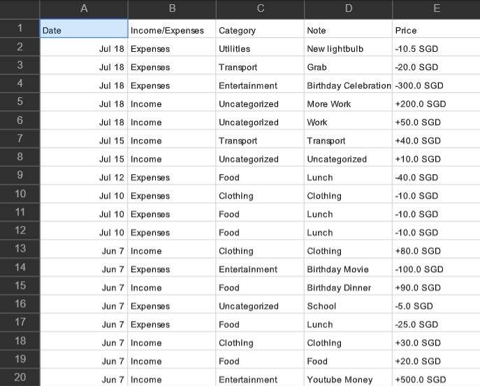

# MAD_Team4_Finance_Tracker

MEMBER - STUDENTID 
Jordan Lee - S10196128 
Derek Qua - S10196775 
Jonavan Voo - S10196680 
Aaron Choo - S10194746 

DESCRIPTION OF APP 
MoneySmart makes it easy for anyone to manage their finances and become 
a smart spender. Its main feature includes being able to enter different 
transaction types, income and expenses, to keep track of your total  
balance. Each transaction is tagged with a category to help you keep 
track of how much money you're spending on Food, or Clothing for example. 

You can also open the report page to view statistics for the last 3 months, 
including a bar chart comparing total income/expenses between the 3 months 
and a pie chart for income/expenses of the selected month, broken down by 
category. (refer to <a href="#screenshots">screenshots</a> below) 

The history page allows you to look through all your previous transactions. 
You can filter through them by using the search function, which searches for 
matches in the category as well as notes of each transaction. 

The goal page allows you to set financial goals for yourself, which you can 
look at whenever you want to feel motivated. For example, you can add a goal 
called "Save $400 for Nintendo Switch" and you'll be motivated to save money 
for that Switch. 

The settings page allows you to switch the app to dark mode and clear your 
data, which will reset the balance to $0.00 and delete all previous 
transactions. You can also turn on daily notifications, which are meant to 
remind you to update your finances regularly. Finally, You can also export 
your data as a csv file on your phone or to your email. 
 

ROLES AND CONTRIBUTIONS 
Jordan: Home, Report, Expense, BottomNavBar 
Derek: Home, History, Settings, Income 
Jonavan: Goals, Slides, BottomNavBar 
Aaron: Report, BottomNavBar, Settings 

SCREENSHOTS 
 
 
 
 
 
 
 
 
